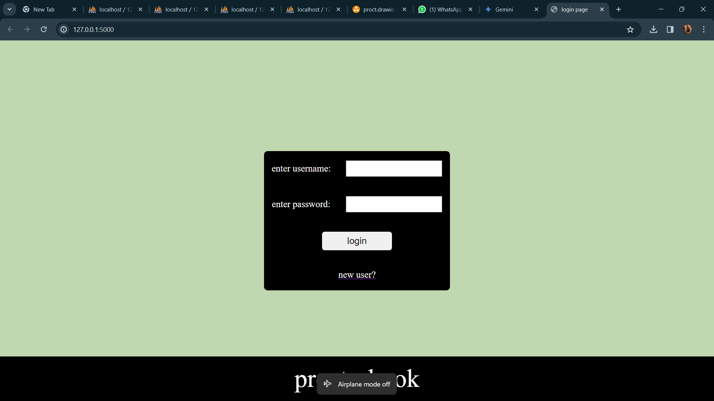

# Proctor Book

Proctor Book is a Flask-based web application designed for academic management, allowing the storage, retrieval, and management of student records, marks, attendance, and other related information. The system distinguishes between staff and student users, providing different functionalities based on the user type.

## Features

- **User Authentication**: Secure signup and login functionalities with password hashing.
- **Student Management**: Add, update, and view student information including personal details, academic records, and proctor details.
- **Marks Management**: Input and update internal assessment and final marks for each subject.
- **Attendance Management**: Record and update student attendance.
- **User Roles**: Distinguishes between student and staff users, with proctors having additional access to manage student information.
- **Flask-Login Integration**: Implements user session management using Flask-Login.

## Technologies Used

- **Backend**: Flask, Python
- **Database**: SQLite (or other databases supported by SQLAlchemy)
- **Frontend**: HTML, CSS, Bootstrap
- **Authentication**: Flask-Login, Flask-WTF

## Usage

- **Staff Users**: Login and manage student records, marks, and attendance.
- **Students**: Login and view personal records, marks, and attendance.

## Screenshots

.png)
.png)
.png)
.png)
.png)

